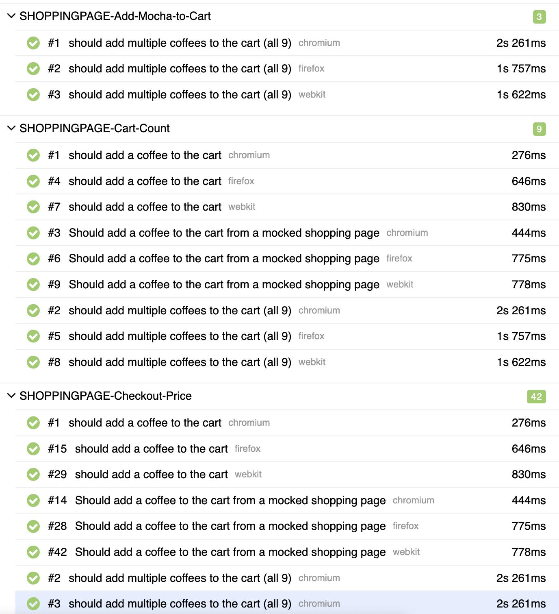

## About this Repo

This repository demonstrates my approach to writing Playwright tests, highlighting techniques I use, tricks I find helpful, and new concepts I'm exploring. It is designed to demonstrate my ability to automate with Playwright but also to illustrate my understanding of building a complete testing framework, including reporting, continuous integration, and more. On CI (github), the allure report is published at: [Playwright Demo Test Report](https://bsurry.github.io/Playwright-Demo/)

## About the Author

[Beth Surry](https://www.linkedin.com/in/elizabeth-surry/) - I am a quality engineer with a passion for automation and testing. I enjoy writing impactful tests that fail when they are supposed to and provide quality information always.

## Here's What to Check Out

Page Object + Fixtures - I create traditional page objects for pages in the application and then use Playwright's fixture capability to create them as part of test setup. This gives you the benefit of traditional page objects but puts the overhead of instantiating those objects into the fixture itself and can simply be made available to any test that needs it 

```typescript
//In the fixture file:
coffeeShoppingPage: async ({ page }, use) => {
    const coffeeShoppingPage = new CoffeeShoppingPage(page);
    await use(coffeeShoppingPage);
},

//in a test that uses this page object, the coffeShoppingPage is created in the fixture and it exists ready to go
test('should add a coffee to the cart', async ({ coffeeShoppingPage }) => {
    const item = coffeeItems[0];
    await coffeeShoppingPage.addCoffeeToCart(item.testid);
    await coffeeShoppingPage.checkCartTotal(item.price.toString());
    await coffeeShoppingPage.checkCartCount(1);
});
```

I use `test.step` where appropriate for making sections of the tests more readable (highly useful once we get viewing playwright native or allure reports)

[Custom error messages on expect statement](https://playwright.dev/docs/test-assertions#custom-expect-message) also make for clarity of steps (especially when failures occur)

Allure reporter configuration - I like creating functional/behavior mapping that we can use in Allure in page object functions. This then lets us see those behaviors across tests in the reports. I created helper functions for this in the `myAllure.ts`

```typescript
export async function feature(prefix: myFeaturePrefixes, feature: string) {
    await allure.feature(`${prefix}-${feature}`);
}
```
this function allows us to tag any page object function (or part of a test) with a specific `feature` name as well as one of the `prefix` values defined in the helper. An example in this suite is `SHOPPINGPAGE-Add-Espresso-to-Cart` Then if you check out the [allure report behaviors pages](https://bsurry.github.io/Playwright-Demo/32/#behaviors/) hosted in github pages, you can see how those behaviors map in the test cases:


## Organization

- **`tests/` Directory**: Contains example test scripts.
- **`playwright.config.js`**: Configuration file for Playwright.
- **`test-helpers` Directory**: contains helper functions with shared functions for using in tests
- **`page-objects` Directory**: contains page objects for pages in the application
- **`fixtures` Directory**: takes advantage of playwright fixtures to be able to create the page objects there and not in tests and also sometimes set up test conditions

## Tools and Packages

- [Playwright](https://playwright.dev): A framework for end-to-end testing.
- [Node.js](https://nodejs.org): JavaScript runtime environment.
- [npm](https://www.npmjs.com): Package manager for JavaScript.
- [allure-playwright](https://www.npmjs.com/package/allure-playwright): Allure Reporting integration for Playwright
- [playwright ctrf reporter](https://github.com/ctrf-io/playwright-ctrf-json-reporter): Reporter format to allow prettier github reporting
- [github test reporter](https://github.com/ctrf-io/github-test-reporter): Github actions test reporting


## Sites to Test

- [Awesome Sites to Test on](https://github.com/BMayhew/awesome-sites-to-test-on) A list of testing sites
- [Coffee Cart](https://coffee-cart.app/) A site that allows me to build realistic E2E scenarios
- [Evil Tester Test Page](https://testpages.eviltester.com/styled/index.html) Test Page For Testing Specific UI functions

## Links to References I used for learning and inspiration

- [Using Functional Helpers](https://dev.to/muratkeremozcan/page-objects-vs-functional-helpers-2akj) - I did use traditional Page Objects in my last job but I do like the simplicity discussed here so started using this
- [Using POM with Playwright Fixtures](https://kailash-pathak.medium.com/playwright-fixtures-vs-pom-which-one-should-you-choose-d2ff01ec4f58) but then I found that I really liked the POM + fixture model here. I had used fixtures at my previous job but I think this specific method unlocks the full power of them
- [Playwright results in Github Actions](https://medium.com/@ma11hewthomas/view-playwright-test-results-in-github-actions-1459f0c3b3bb)

## Running Tests

To run the tests, use one of the following commands:

```bash
# Run all tests
npx playwright test
# or 
npm test


# Run tests in specific browser
npx playwright test --project=chromium
npx playwright test --project=webkit
npx playwright test --project=firefox
#or
npm run test:chromium
npm run test:webkit
npm run test:firefox
```

## Generating Allure Reports

1. Run tests with Allure reporter:
```bash
npx playwright test --reporter=allure-playwright 
# this is generated by default in current set up no need to command
```

2. Generate the Allure HTML report:
```bash
allure generate ./allure-results -o ./allure-report --clean
# or 
npm run allure:generate
```

3. Open the Allure report in your default browser:
```bash
allure open ./allure-report
# or
npm run test:allure:open
```

Note: Make sure you have Allure command-line tool installed. If not, install it using:
```bash
npm install -g allure-commandline
```
